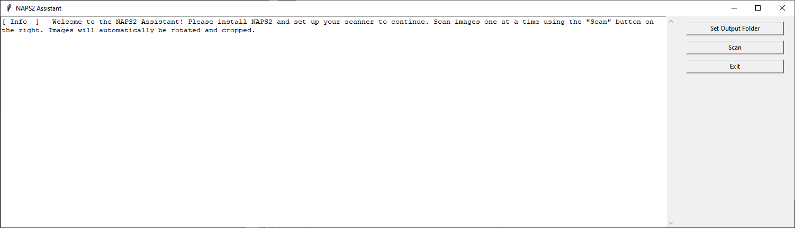
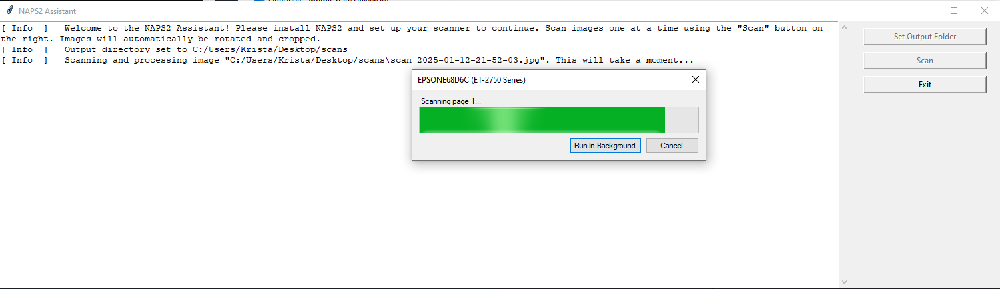
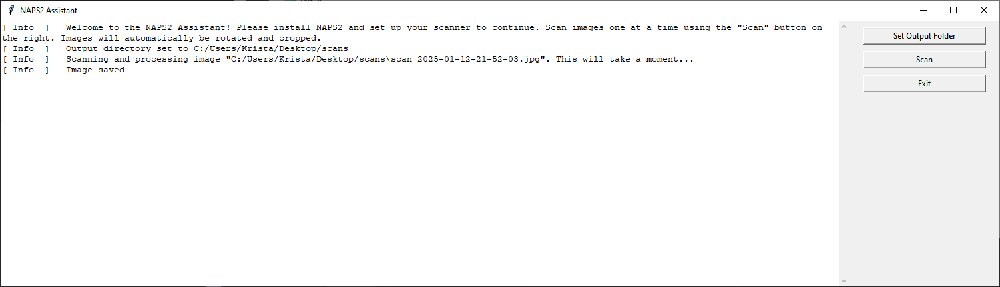
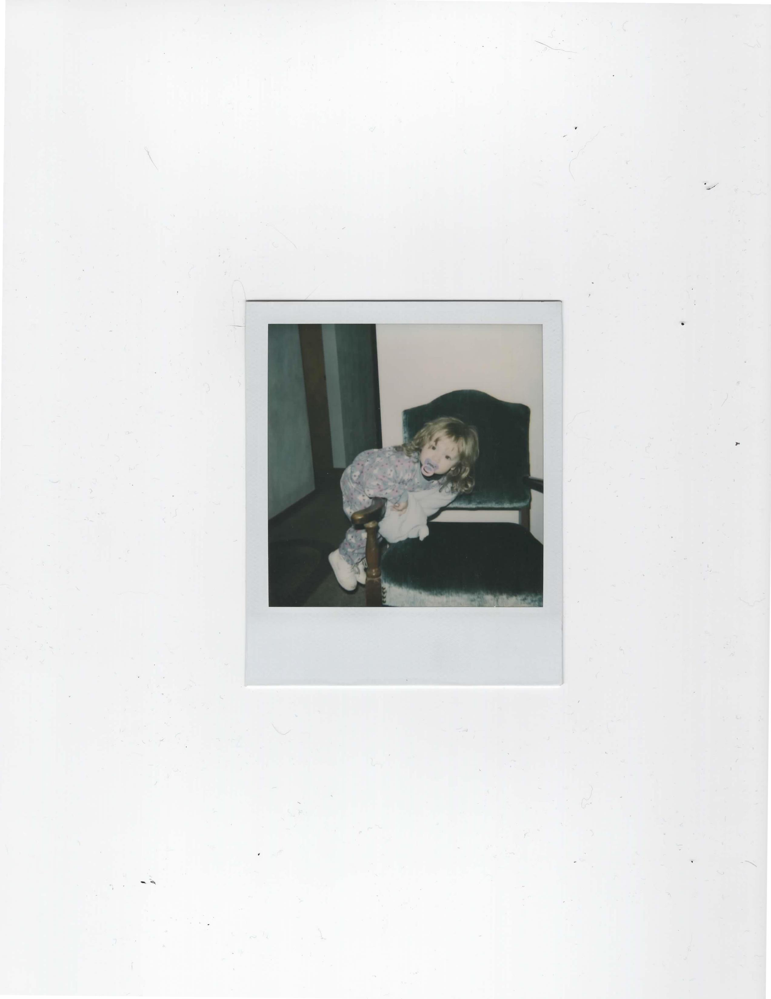

# NAPS2 Assistant

This is a GUI python application that piggy-backs off of [NAPS2](https://www.naps2.com/), a popular printer scanner utility, to scan and crop images.

## Setup

Install [NAPS2](https://www.naps2.com/) and follow instructions to set up a profile for your local printer/scanner.

> This is a requirement before running NAPS2 Assistant!

## Usage

Once you've set up NAPS2 and you are connected to a printer/scanner you're ready For NAPS2 Assistant! To run, opening a console in the root directory of this repository and run `python app.py`. NAPS2 Assistant will look like this:

Set an output directory for the scanned images using the "Set Output Folder" button, or hit the "Scan" button, and you'll be prompted to enter one.

> You must set a valid output directory before trying to scan images

If you haven't hit the "Scan" button yet, do that. If you've set up NAPS2 and are connected to your printer, you should see a scan progress bar like this:

> If you do not have NAPS2 set up, you will get a bunch of gobbledygook output in the log window, with the error somewhere in that text. Try exiting, fixing your NAPS2 setup, and rerunning the application.

Your log window should look like this on successful completion of a scan:

Two images will be saved, one with the printed image name in the log window, and another with the "cropped" postfix in case you want to save the original scan image.

# Example Results

Here is an example of the type of images I was cropping, they were some old slides from my grandparents'. If your scanner/images have a different shade of white background, you may need to adjust the `FUZZY_WHITE_VALUE` variable in the code until you get a desired crop.

### Image Directly After NAPS2 Scan (skew from imperfectly placed picture will be fixed)

### Image After Cropping

Aren't I cute?